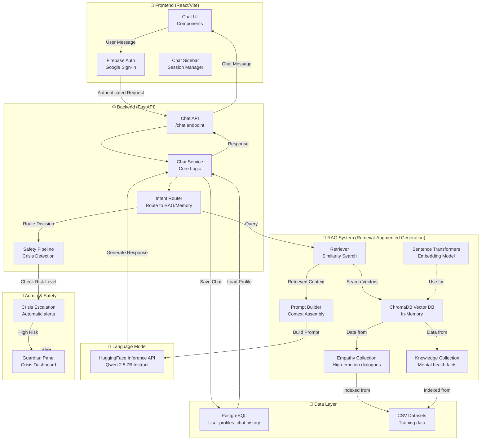

# MyAlly Mental Health Chatbot - System Architecture



## How to Export as Image

### Option 1: **Using VS Code Extension** (Easiest)
1. Install **"Markdown Preview Mermaid Support"** extension in VS Code
2. Open this file and preview it (Ctrl+Shift+V)
3. Right-click on the diagram → **Export as PNG/SVG**

### Option 2: **Using Mermaid CLI**
```bash
npm install -g @mermaid-js/mermaid-cli
mmdc -i SYSTEM_ARCHITECTURE.md -o architecture.png
```

### Option 3: **Using Online Editor**
1. Go to https://mermaid.live
2. Copy the diagram code (between the backticks)
3. Paste it in the editor
4. Click "Export" → Download as PNG/SVG

---

## System Flow

1. **User sends message** → Frontend UI
2. **Firebase authenticates** the user
3. **Backend API receives** the message
4. **Service layer routes** to RAG + Safety check
5. **Safety pipeline detects** if crisis/high-risk
6. **If safe**: RAG system retrieves relevant context
   - Embeddings convert text to vectors
   - Searches ChromaDB (Empathy & Knowledge collections)
   - Returns relevant mental health dialogue patterns + facts
7. **Prompt builder** assembles context + user message
8. **HuggingFace LLM** generates empathetic response
9. **Response sent back** to UI
10. **Chat saved** to PostgreSQL for user memory
11. **If crisis detected**: Auto-escalates to Guardian Panel (admin dashboard)

---

## Key Data Collections

- **Empathy Docs**: Emotional dialogue patterns (Reddit, Empathetic Dialogues dataset)
- **Knowledge Docs**: Mental health facts (MHQA dataset)
- **User Data**: Profiles, preferences, chat history (PostgreSQL)
